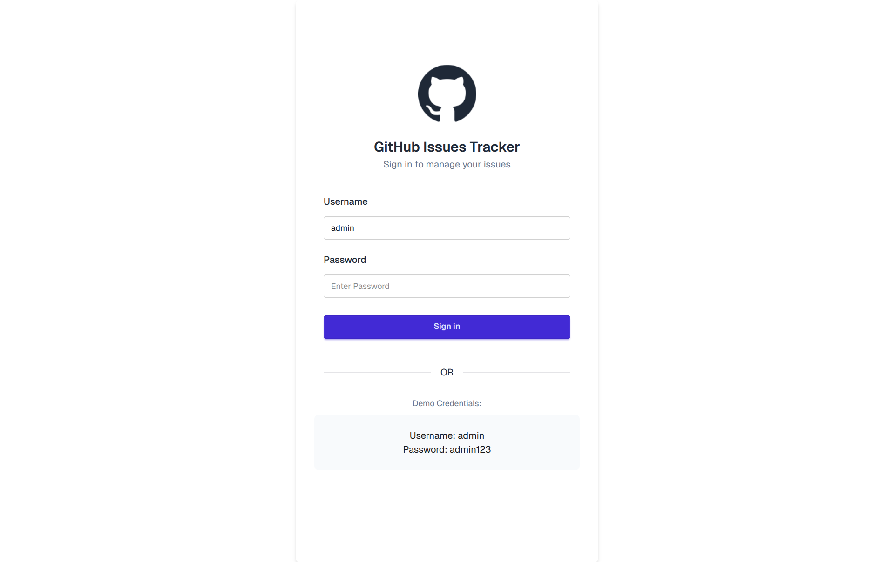
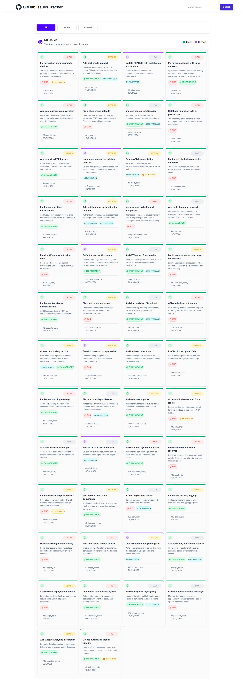

# GitHub Issues Tracker

## Project Overview
This is a web application that allows users to track and manage GitHub issues. Users can log in to view all issues, filter by status (open or closed), and search for specific issues. The app fetches issue data from an external API and displays them in a user-friendly interface.

## Screenshot



## Technologies Used
- HTML
- CSS
- JavaScript
- Tailwind CSS
- DaisyUI

## Features
- User authentication with login page
- Display all GitHub issues fetched from API
- Filter issues by status (all, open, closed)
- Search functionality for issues
- Priority-based styling for issues (high, medium, low)
- Responsive design for mobile and desktop

## Dependencies
- DaisyUI (for UI components)
- Tailwind CSS (for styling)
- Font Awesome (for icons)
- Google Fonts (Geist font family)

## Run Locally
Follow these steps to run the project on your local machine:

1. Clone the repository:
   ```
   git clone <repository-url>
   ```

2. Navigate to the project folder:
   ```
   cd B13-A5-Code
   ```

3. Open the `index.html` file in your web browser to start the application.

   Alternatively, you can serve the files using a local HTTP server. For example, using Python:
   ```
   python -m http.server 8000
   ```
   Then open `http://localhost:8000` in your browser.

## Links
- Live Demo: https://github-issue-toast.netlify.app/
- GitHub Repository: https://github.com/ShafayatSadid/B13-A5-Code